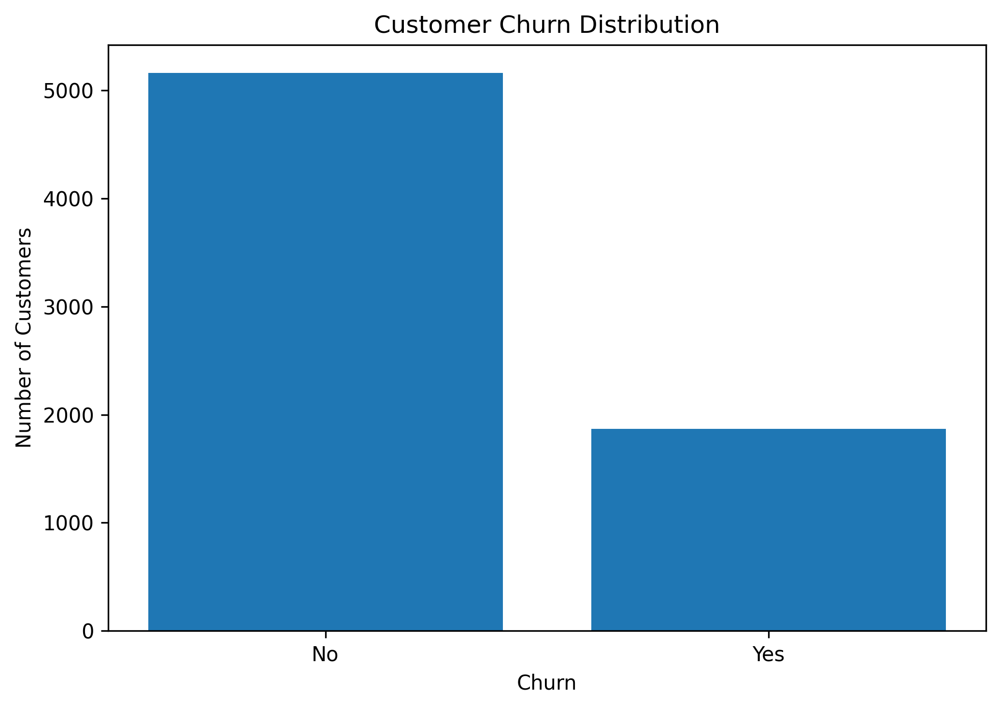
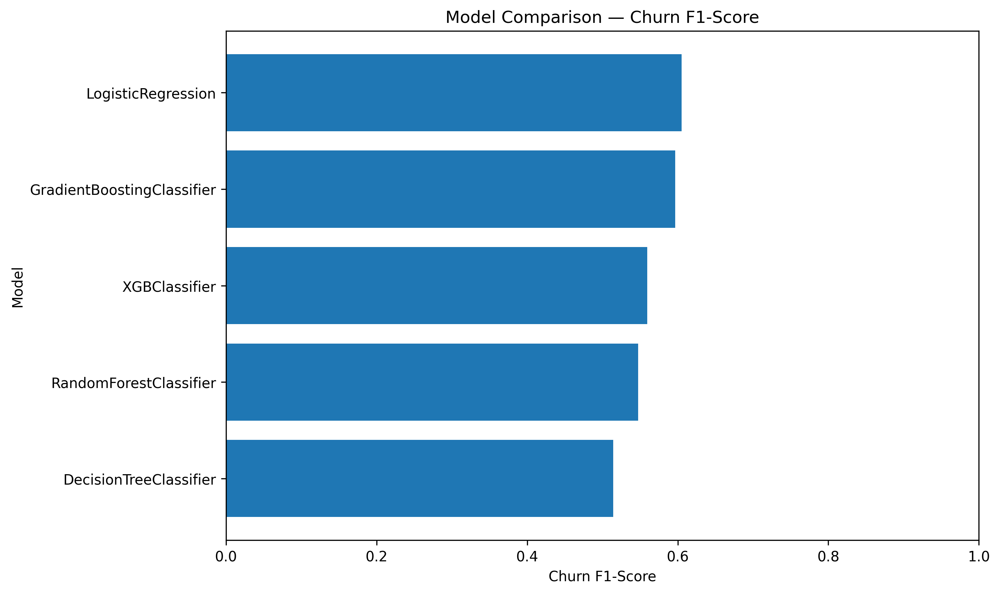
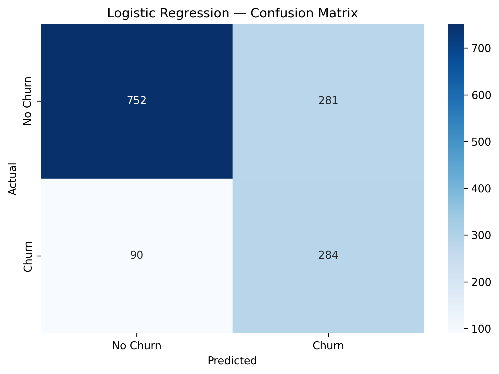
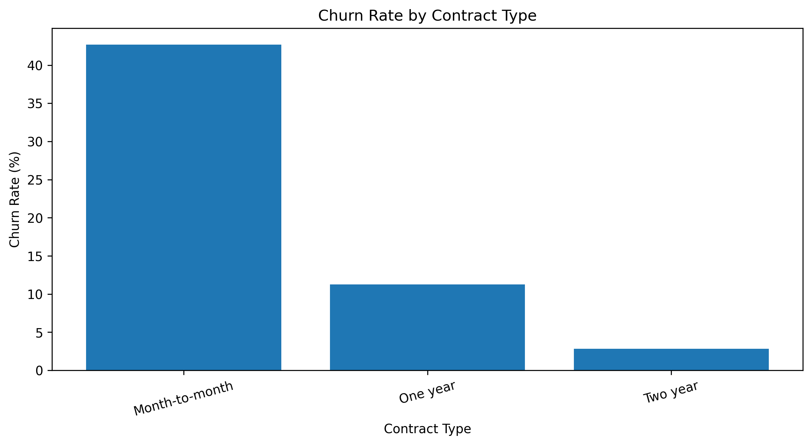

# Customer Churn Prediction

## Project Overview

This project develops a machine learning classification solution to predict customer churn.

The objective is to identify customers who are likely to leave so that businesses can take proactive customer-retention actions.

The project covers an end-to-end machine learning workflow:

- Data inspection
- Data cleaning
- Exploratory Data Analysis (EDA)
- Feature engineering
- Categorical encoding
- Feature scaling
- Multicollinearity analysis using VIF
- Train/test splitting
- Class imbalance handling using SMOTE
- Model training
- Model evaluation
- Model comparison
- Final model selection
- Business interpretation

## Business Objective

Customer churn can negatively affect recurring revenue, customer lifetime value, and business growth.

The objectives are to:

- Identify customers at higher risk of churn
- Understand factors associated with customer churn
- Compare multiple classification algorithms
- Select a model using business-relevant metrics
- Provide actionable customer-retention insights

## Project Process Flow

```text
Business Problem
       ↓
Load Dataset
       ↓
Data Inspection
       ↓
Data Cleaning
       ↓
Exploratory Data Analysis
       ↓
Feature Engineering
       ↓
Categorical Encoding
       ↓
Feature Scaling
       ↓
Multicollinearity Analysis
       ↓
Train/Test Split
       ↓
SMOTE on Training Data
       ↓
Model Training
       ↓
Model Evaluation
       ↓
Model Comparison
       ↓
Final Model Selection
       ↓
Business Insights
```

## Dataset

The project uses a customer churn dataset containing customer demographic, account, service, contract, billing, and churn information.

### Target Variable

`Churn`

- `Yes` = Customer churned
- `No` = Customer did not churn

## Data Preparation

The following preprocessing steps were performed:

- Dataset inspection
- Data type validation
- Missing-value checks
- Conversion of `TotalCharges` to numeric format
- Handling of invalid/blank values
- Removal of invalid or missing observations where required
- Removal of customer ID from modelling features
- Categorical variable encoding
- Numerical feature scaling

## Exploratory Data Analysis

Exploratory Data Analysis was performed to understand customer characteristics and their relationship with churn.

Key variables investigated include:

- Gender
- Senior citizen status
- Partner status
- Dependents
- Tenure
- Phone service
- Internet service
- Online security
- Online backup
- Device protection
- Tech support
- Streaming services
- Contract type
- Paperless billing
- Payment method
- Monthly charges
- Total charges

## Customer Churn Distribution



The churn distribution shows the proportion of customers who churned compared with customers who remained with the company.

## Feature Engineering

Categorical variables were converted into numerical features using one-hot encoding.

The customer identifier was removed because it does not provide meaningful predictive information.

Numerical variables were standardized where required for modelling.

## Feature Scaling

`StandardScaler` was used to standardize numerical features.

Feature scaling is particularly useful for algorithms such as Logistic Regression because features measured on different numerical scales can otherwise influence the model differently.

## Multicollinearity Analysis

Variance Inflation Factor (VIF) was used to investigate multicollinearity among predictor variables.

Highly correlated predictors can make some models less stable and can make coefficient interpretation more difficult.

Features with high multicollinearity were reviewed and removed where appropriate.

## Train/Test Split

The dataset was divided into training and testing datasets using an 80/20 split.

```text
Training Data → Model Development
Testing Data  → Final Evaluation
```

The test dataset was kept separate from the training process so that model performance could be evaluated on previously unseen observations.

## Class Imbalance and SMOTE

The original customer churn data contains fewer churned customers than non-churned customers.

SMOTE (Synthetic Minority Over-sampling Technique) was applied to the training data to create a more balanced training distribution.

```text
Imbalanced Training Data
          ↓
         SMOTE
          ↓
Balanced Training Data
          ↓
    Model Training
```

SMOTE was applied only to the training data. The test data remained unchanged so that final model evaluation remained unbiased.

## Machine Learning Models

Five classification algorithms were compared:

1. Logistic Regression
2. Decision Tree
3. Random Forest
4. Gradient Boosting
5. XGBoost

### Logistic Regression

A linear classification algorithm that provides a strong and interpretable baseline for binary classification.

### Decision Tree

A tree-based algorithm that makes predictions using a sequence of feature-based decision rules.

### Random Forest

An ensemble of decision trees designed to improve predictive performance and reduce overfitting.

### Gradient Boosting

An ensemble method that builds models sequentially, with each new model attempting to improve the previous model.

### XGBoost

A gradient-boosting algorithm designed for high predictive performance on structured/tabular data.

## Model Evaluation

The models were evaluated using:

- Accuracy
- Precision
- Recall
- F1-score

For this churn problem, churn recall is particularly important because failing to identify a customer who is going to churn can represent a lost retention opportunity.

## Model Comparison

| Model | Accuracy | Churn Precision | Churn Recall | Churn F1 |
|---|---:|---:|---:|---:|
| Logistic Regression | 73.63% | 50.27% | **75.94%** | **60.49%** |
| Gradient Boosting | 75.69% | 53.38% | 67.65% | 59.67% |
| XGBoost | 76.62% | 56.03% | 55.88% | 55.96% |
| Random Forest | **76.83%** | 56.94% | 52.67% | 54.72% |
| Decision Tree | 72.35% | 48.24% | 55.08% | 51.44% |

## Model Performance Visualization



The visualization compares the churn F1-score of the evaluated models.

## Final Model Selection

### Selected Model: Logistic Regression

Random Forest achieved the highest overall accuracy at **76.83%**.

However, Logistic Regression achieved the highest:

- **Churn Recall: 75.94%**
- **Churn F1-score: 60.49%**

Because the primary business objective is to identify customers who are at risk of leaving, Logistic Regression was selected as the final model.

Although Random Forest provides slightly higher overall accuracy, Logistic Regression identifies a larger proportion of the customers who actually churned.

## Confusion Matrix

The confusion matrix provides a detailed view of correct and incorrect predictions from the selected Logistic Regression model.



### Confusion Matrix Interpretation

```text
True Negative
→ Correctly predicted non-churn

False Positive
→ Non-churn customer predicted as churn

False Negative
→ Churn customer predicted as non-churn

True Positive
→ Correctly predicted churn
```

False negatives are particularly important in a churn-retention problem because they represent customers who churned but were not identified by the model.

## Business Insights

The model can support customer-retention activities by helping businesses identify customers who may be at higher risk of churn.

Potential actions include:

1. Identify high-risk customers.
2. Prioritize retention campaigns.
3. Investigate contract characteristics associated with churn.
4. Provide targeted offers or incentives.
5. Monitor customer behaviour over time.
6. Retrain the model periodically using new customer data.

## Churn Rate by Contract Type



The contract-level churn analysis helps identify contract groups that may require additional retention strategies.

## Technologies Used

- Python
- Pandas
- NumPy
- Matplotlib
- Seaborn
- Scikit-learn
- XGBoost
- Imbalanced-learn
- SMOTE
- Jupyter Notebook

## Project Structure

```text
Customer-Churn-Prediction/
│
├── data/
│
├── notebooks/
│   └── Customer_Churn_Prediction.ipynb
│
├── visualizations/
│   ├── model_performance_comparison.png
│   ├── logistic_regression_confusion_matrix.png
│   ├── churn_distribution.png
│   └── churn_by_contract.png
│
├── README.md
│
└── requirements.txt
```

## Limitations

The model should be treated as a decision-support tool rather than an automatic decision-making system.

False positives and false negatives have different business costs.

The appropriate classification threshold should ultimately be determined using the business cost of retention campaigns and potential customer loss.

## Future Improvements

Potential future improvements include:

- Hyperparameter tuning
- Cross-validation
- Probability-threshold optimization
- ROC-AUC analysis
- Precision-Recall AUC analysis
- Feature importance analysis
- SHAP explainability
- Model calibration
- Customer churn probability scoring
- Deployment using Flask or FastAPI
- Customer-risk dashboard using Power BI
- Automated model retraining

## Key Skills Demonstrated

- Python
- Pandas
- NumPy
- Data Cleaning
- Exploratory Data Analysis
- Feature Engineering
- One-Hot Encoding
- Feature Scaling
- Multicollinearity Analysis
- VIF
- SMOTE
- Classification
- Logistic Regression
- Decision Trees
- Random Forest
- Gradient Boosting
- XGBoost
- Model Evaluation
- Precision
- Recall
- F1-score
- Data Visualization
- Business Analysis
- Machine Learning Workflow

## Key Takeaway

The project demonstrates that model selection should be driven by the business objective rather than simply selecting the model with the highest accuracy.

```text
Highest Overall Accuracy
          ↓
    Random Forest
          ↓
        76.83%
```

while:

```text
Highest Churn Recall
          ↓
  Logistic Regression
          ↓
        75.94%
```

and:

```text
Highest Churn F1
          ↓
  Logistic Regression
          ↓
        60.49%
```

For this customer-retention problem, **Logistic Regression was selected as the final model** because it provides the strongest churn-identification performance among the evaluated models.

## Author

**Murugavel Thenpair Gnanasekaran**

Mechanical Engineer | Aspiring Data Scientist

Advanced Certification in Data Science & AI

### Skills

- SQL
- Power BI
- DAX
- Python
- Machine Learning
- Data Analysis
- Statistics

### Connect

- [GitHub Profile](https://github.com/murugavel-tg)
- [LinkedIn Profile](https://www.linkedin.com/in/murugavel-thenpair-gnanasekaran)
