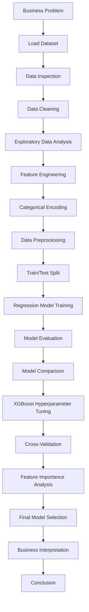

# House Price Prediction

## Project Overview

This project develops a machine learning regression solution to predict house sale prices.

The objective is to estimate the selling price of a residential property based on its available property characteristics.

The project follows an end-to-end machine learning workflow covering:

- Data inspection
- Data cleaning
- Exploratory Data Analysis (EDA)
- Feature engineering
- Categorical encoding
- Data preprocessing
- Train/test splitting
- Regression model development
- Model evaluation
- Model comparison
- XGBoost hyperparameter tuning
- Cross-validation
- Feature importance analysis
- Business interpretation

---

## Business Objective

Accurate property-price estimation can support real-estate valuation and decision-making.

The objectives of this project are to:

- Predict residential house sale prices
- Understand relationships between property characteristics and sale prices
- Compare different regression algorithms
- Evaluate model performance using appropriate regression metrics
- Identify the strongest-performing model
- Understand important predictors influencing house-price predictions
- Provide a machine-learning-based approach to property valuation

---

## Project Process Flow

---

# Model Evaluation and Comparison

Multiple regression models were developed and evaluated to identify the best-performing model for house-price prediction.

The models evaluated were:

- Linear Regression
- Random Forest Regressor
- Gradient Boosting Regressor
- XGBoost Regressor

## Model Performance

| Model | R² Score |
|---|---:|
| Linear Regression | 0.5785 |
| Random Forest Regressor | 0.6879 |
| Gradient Boosting Regressor | 0.6699 |
| **XGBoost Regressor** | **0.7197** |

### Best Performing Model

**XGBoost Regressor**

The XGBoost model achieved the highest test-set R² score of **0.7197** among the evaluated models.

Therefore, XGBoost was selected as the final model for the house-price prediction project.

---

# XGBoost Model Performance

The XGBoost model achieved the following test-set result:

| Metric | Result |
|---|---:|
| **R² Score** | **0.7197** |

The result indicates that the XGBoost model provided the strongest predictive performance among the models evaluated in this project.

---

# Hyperparameter Tuning

Because XGBoost achieved the best initial performance, hyperparameter tuning was performed to identify a stronger configuration.

`RandomizedSearchCV` was used to search across different XGBoost hyperparameter combinations.

The tuning process used:

- 20 randomized parameter combinations
- 5-fold cross-validation
- R² as the scoring metric
- `random_state=42`

The optimized model was stored as:

```python
best_model
