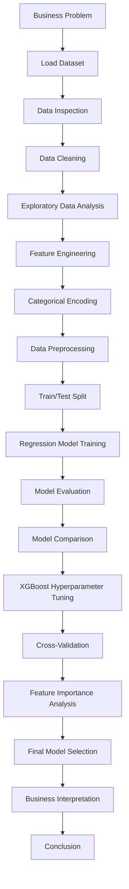

# House Price Prediction

## Project Overview

This project develops a machine learning regression solution to predict house sale prices.

The objective is to estimate the selling price of a residential property based on its available property characteristics.

The project follows an end-to-end machine learning workflow covering:

- Data inspection
- Data cleaning
- Exploratory Data Analysis (EDA)
- Feature engineering
- Categorical encoding
- Data preprocessing
- Train/test splitting
- Regression model development
- Model evaluation
- Model comparison
- XGBoost hyperparameter tuning
- Cross-validation
- Feature importance analysis
- Business interpretation

---

## Business Objective

Accurate property-price estimation can support real-estate valuation and decision-making.

The objectives of this project are to:

- Predict residential house sale prices
- Understand relationships between property characteristics and sale prices
- Compare different regression algorithms
- Evaluate model performance using appropriate regression metrics
- Identify the strongest-performing model
- Understand important predictors influencing house-price predictions
- Provide a machine-learning-based approach to property valuation

---

## Project Process Flow

